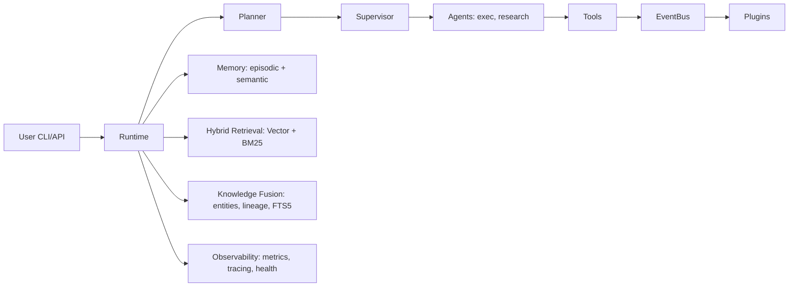

# URA — Multi-Agent Platform

[](https://github.com/ramon-kaixo/-ura-ai/actions/workflows/ci.yml)
[](https://python.org)
[](https://github.com/astral-sh/ruff)

URA is a modular multi-agent system with semantic retrieval, episodic/semantic memory,
a consensus-driven agent runtime, full observability, and an **intelligent conversational assistant**
with real-time streaming, multi-language support, vector memory, web search, and tool execution.

🚀 **Asistente desplegado en GX10:** `http://10.164.1.99:8003`
📖 **API docs:** [docs/API_ASSISTANT.md](docs/API_ASSISTANT.md)

```
                                        ┌──────────────┐
                                        │   Ollama     │
                                        │  (LLM + emb) │
                                        └──────┬───────┘
                                               │
┌──────┐    ┌──────────┐    ┌──────────┐    ┌──┴────────┐    ┌──────────┐
│ User │───▶│ Runtime  │───▶│ Planner  │───▶│ Supervisor│───▶│ Agents   │
│ CLI  │    │          │    │          │    │           │    │ (exec,   │
│ API  │    │          │    │          │    │           │    │  research)│
└──────┘    └──────────┘    └──────────┘    └───────────┘    └──────────┘
                            ┌──────────┐    ┌──────────┐    ┌──────────┐
                            │ Memory   │    │ Retrieval│    │ Metrics  │
                            │ (episodic│    │ (hybrid) │    │ + Logging│
                            │  semantic│    │ + BM25   │    │ /health  │
                            └──────────┘    └──────────┘    └──────────┘
```

### Arquitectura (Mermaid)



## Features

- **Multi-Agent Runtime**: Planner, Researcher, Executor, Validator, Supervisor, Reflection
- **Consensus Engine**: Majority, Unanimous, Weighted voting with configurable strategies
- **Memory System**: Episodic (sessions, TTL, SQLite), Semantic (facts, dedup, versioned)
- **Hybrid Retrieval**: Vector (Qdrant) + BM25 with weighted fusion and reranking
- **Observability**: Prometheus metrics, JSON logging, Grafana dashboard, health checks
- **Semantic Chunking**: Document splitting by structure (headings, paragraphs, overlap)
- **Docker**: Multi-stage image, docker-compose with Qdrant + optional Ollama
- **CI/CD**: GitHub Actions, PyPI package, wheel/sdist

## Installation

### From source

```bash
git clone https://github.com/ramon-kaixo/-ura-ai.git
cd ura-ai
pip install -e ".[dev]"
```

### Docker

```bash
docker compose up -d
# With Ollama:
docker compose --profile ollama up -d
```

## Quick Start

See [QUICKSTART.md](docs/QUICKSTART.md) for a complete 10-minute guide.

```bash
# Run a basic workflow
ura "search for EventBus documentation"

# Check system health
curl localhost:8000/health

# View metrics
curl localhost:8000/metrics
```

## Project Structure

```
ura-ai/
├── core/                  → Domain logic, legacy (90 files)
├── motor/
│   ├── core/              → UraConfig, LLM providers, Qdrant, secrets
│   ├── memory/            → F26 Historical Memory (Timeline, Journal, Snapshot)
│   ├── agents/            → F27 Autonomous Agents (CapabilityGate, ToolRunner, Scheduler)
│   ├── platform/          → F28 Platform Protocols (Envelope, Tracing, Health)
│   ├── events/            → EventBus, hooks, topics
│   ├── pipeline/          → Dynamic pipeline executor
│   ├── plugin/            → Plugin system, manifests, registry
│   └── observability/     → Metrics, structured logging, health
├── knowledge/
│   └── engine/            → Knowledge Engine (graph, FTS5, Qdrant sync)
├── deploy/                → Docker, systemd, grafana, prometheus
├── tests/                 → 145 test files, 3,218+ tests
├── Dockerfile
├── docker-compose.yml
└── pyproject.toml
```

## Configuration

Configuration is via environment variables or `.env` file:

| Variable | Default | Description |
|----------|---------|-------------|
| `URA_OLLAMA_HOST` | `localhost` | Ollama host |
| `URA_OLLAMA_PORT` | `11434` | Ollama port |
| `URA_QDRANT_HOST` | `localhost` | Qdrant host |
| `URA_QDRANT_PORT` | `6333` | Qdrant port |
| `URA_LOG_LEVEL` | `INFO` | Log level |
| `URA_PORT` | `8000` | HTTP server port |
| `URA_HOST` | `0.0.0.0` | HTTP bind address |

## Running

```bash
# Development
python -m uvicorn motor.observability.http:app --reload

# Production
python entrypoint.sh

# Docker
docker compose up -d
```

## Testing

```bash
pip install -e ".[dev]"
pytest -q --tb=line tests/
```

## Docker

```bash
docker build -t ura .
docker run -p 8000:8000 ura
```

## Observability

| Endpoint | Description | Status |
|----------|-------------|--------|
| `/metrics` | Prometheus OpenMetrics (Counter, Gauge, Histogram) | ✅ |
| `/health` | Health check with component-level status | ✅ |
| Tracing | Correlation IDs via ContextFilter, span tree validation | ✅ |
| Logging | JSON structured logging with correlation_id/workflow_id | ✅ |

## Roadmap

| Phase | Focus | Status |
|-------|-------|--------|
| F0–F9 | Consolidation | ✅ Closed (v4.0.3) |
| Evolution L1 | **Observabilidad** — tracing, dashboards, alertas | 🚧 |
| Evolution L2 | **CI/CD** — GitHub Actions, bandit, mypy | 🚧 |
| Evolution L3 | **Documentación** — README, API reference, ejemplos | 🚧 |
| Evolution L4 | **Mypy** — 53 errores restantes | 🚧 |
| Evolution L5 | **Features** — agente investigación, dashboard web, MCP | 🔮 |

## Architecture

See [ARCHITECTURE.md](docs/ARCHITECTURE.md) for the full system design.

## ADRs

All Architecture Decision Records are in [docs/architecture/](docs/architecture/).

## Contributing

See [PLUGIN_DEV.md](docs/PLUGIN_DEV.md) for the plugin API and extension points.

## License

MIT
