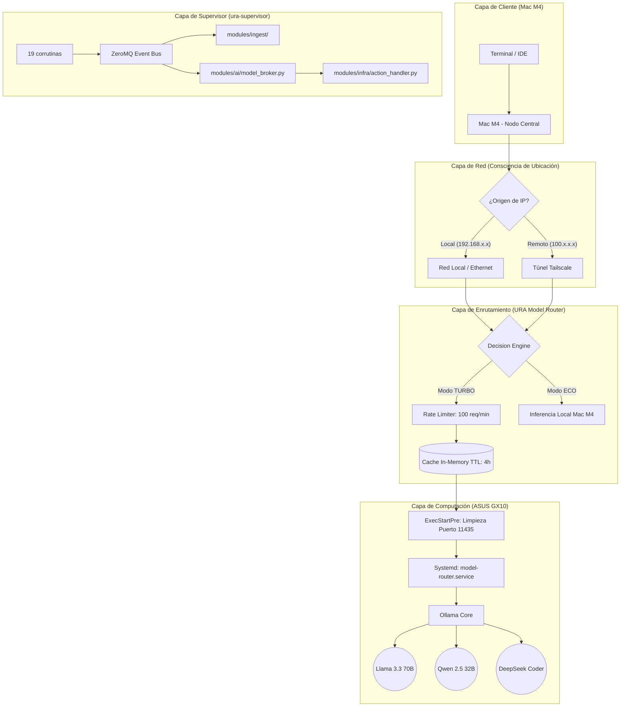

# URA AI Cluster: Arquitectura de Inferencia de Alta Disponibilidad

**Estado:** Producción (Hardened)  
**Latencia Promedio:** <1.5ms  
**Nodos:** 2 (Cliente Ligero + Servidor Computacional)  
**Última actualización:** 2026-06-06

## 1. Topología del Sistema



## 2. Mecanismos de Resiliencia

- **ExecStartPre:** `fuser -k 11435/tcp` elimina zombies antes de arrancar
- **Restart=always** + **RestartSec=5**: auto-recuperación en <5s
- **Health check:** cada 5min vía systemd timer
- **Chaos maintenance:** cada domingo 03:00 (SIGKILL + auto-recovery)
- **StateManager:** Redis → SQLite → JSON fallback en cadena

## 3. 19 Corrutinas del Supervisor

| Categoría | Corrutinas |
|---|---|
| Watchdogs | watchdog_redis, watchdog_disk, watchdog_network, watchdog_heartbeat |
| Collectors | collector_metrics, collector_system |
| Validators | validator_config, validator_syntax, validator_imports |
| Optimizers | optimizer_cache |
| Orquestador | orchestrator, telemetry, ura_alert |
| Ingesta | data_scraper, data_analyzer, ingest_coordinator |
| AI/Infra | ai_broker, ipc_server, heartbeat_task |

## 4. Comandos de Operación

```bash
ura-sup TURBO | ECO | AUTO   # Cambiar modo
ura-sup health | tasks       # Estado del supervisor
ura-status                    # Dashboard completo
ura-status --quick            # Resumen una línea
ura-query --stats             # Estadísticas de telemetría
mode turbo | eco | auto       # Cambio rápido de modo
```
