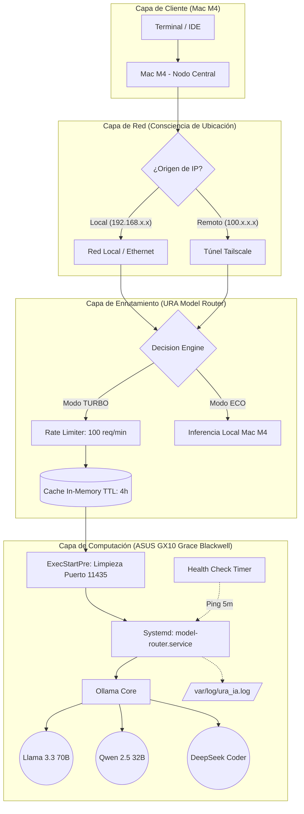

# URA AI Cluster: Arquitectura de Inferencia de Alta Disponibilidad

**Estado:** Producción (Hardened)  
**Latencia Promedio:** <1.5ms  
**Nodos:** 2 (Cliente Ligero + Servidor Computacional)  
**Última actualización:** 2026-06-06

---

## 1. Topología del Sistema

El sistema utiliza una arquitectura distribuida consciente de la red (Network-Aware).
El tráfico se enruta dinámicamente basándose en la ubicación del cliente y la salud
del servidor.



## 2. Mecanismos de Resiliencia (Self-Healing)

### 2.1 Auto-Recuperación de Puertos
- **ExecStartPre:** `/bin/fuser -k 11435/tcp` elimina cualquier proceso zombie
  que ocupe el puerto antes de cada arranque.

### 2.2 Watchdog Systemd
- **Restart=always** + **RestartSec=5**: reinicio automático tras cualquier
  fallo crítico en menos de 5 segundos.
- **NRestarts** monitorizado: actualmente en 0 desde la última estabilización.

### 2.3 Health Check Automático
- **Timer:** `ura-router-health.timer` ejecuta un health check cada 5 minutos.
- **Script:** Verifica el endpoint `/health` del router; si falla 3 veces
  consecutivas, reinicia el servicio automáticamente.
- **Log:** `/var/log/ura_router_health.log`

### 2.4 Rate Limiting
- **Límite:** 100 peticiones por minuto por IP (ventana deslizante).
- **Respuesta:** HTTP 429 (`Too Many Requests`) al exceder el límite.

### 2.5 Degradación Elegante (Network-Aware)
- **Modo AUTO (por defecto):**
  - Cliente local (IP 10.x, 192.168.x, 172.x) → **TURBO** → ASUS GX10
  - Cliente remoto (IP 100.x Tailscale, externa) → **ECO** → Mac M4 local
- **Override manual:** `mode turbo` / `mode eco` / `mode auto` prioriza
  siempre sobre la detección automática.

## 3. Stack Tecnológico

| Componente | Tecnología |
|---|---|
| Servidor ASUS | NVIDIA Grace Blackwell GX10 (128 GB) |
| Cliente | Apple Mac M4 |
| Router IA | Python + http.server (stdlib) v2.2 |
| Modelos | llama3.3:70b, qwen2.5-coder:32b, deepseek-coder:6.7b |
| Init System | systemd (Restart=always + Timer 5min) |
| Red | Ethernet 10.164.1.x + Tailscale 100.x |

## 4. Comandos de Operación

```bash
mode turbo        # Forzar ASUS (máximo rendimiento)
mode eco          # Forzar Mac local (ahorrar batería)
mode auto         # Detección automática por IP (por defecto)

curl http://127.0.0.1:11435/dashboard          # Dashboard HTML
curl http://127.0.0.1:11435/dashboard.json     # Dashboard JSON

tail -f /var/log/ura_ia.log                    # Log del router
tail -f /var/log/ura_router_health.log         # Log del health check

systemctl status model-router                  # Estado del router
systemctl status ura-router-health.timer       # Estado del health check
```

## 5. Métricas de Producción (2026-06-06)

| Métrica | Valor |
|---|---|
| Latencia ASUS | <1.5ms |
| NRestarts (acumulado) | 0 |
| Fallbacks a Local (última hora) | 0 |
| Modelos disponibles | 10 |
| Rate limit | 100 req/min/IP |
| Cache TTL | 4 horas |
