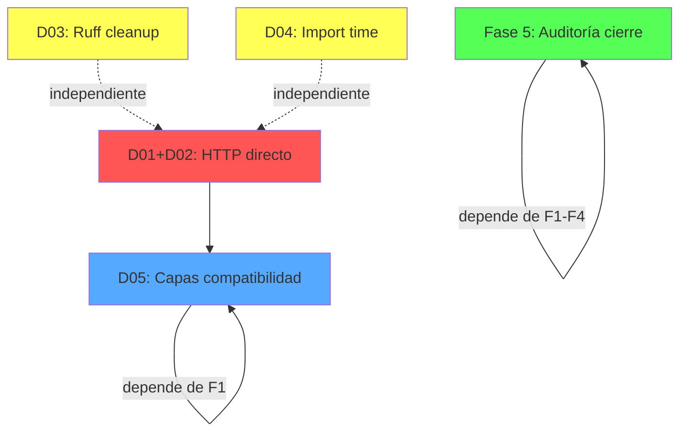

# Plan Maestro de Refactorización y Evolución — URA

**Versión:** 1.1
**Fecha:** 2026-07-21
**Baseline:** `v3.9.0-fase9` (commit `6b1cf90`)
**Total código:** 135.180 líneas, 802 archivos .py, 145 tests

## Estado Actual

### Cerrado (no reabrir)
| Fase | Logro | Tag |
|------|-------|-----|
| Scanner/Diagnostico State | Extraídos de `__init__.py` → módulos + `_state.py` | `v3.5.3` |
| core/interfaces/ | 5 protocolos (IConfigProvider, IExecutor, IVectorStore, ILLMClient, ISecretStore) | `v3.6.0` |
| Facade scripts | motor/cli/public_api (19 símbolos, política documentada) | `v3.6.0` |
| Deprecation policy | DeprecationWarning en __getattr__, reglas en AGENTS.md | `v3.6.1` |
| Logging consolidation | setup_logging() canónico, 0 module-level basicConfig | `v3.7.0` |
| Dead code removal | 731 líneas (providers legacy, build/, param muerto) | `v3.7.2` |
| CircuitBreaker bugfix | Diagnóstico corregido, decisión no consolidar documentada | `v3.7.1` |
| test_debt_cleanup | Registry lazy init regression fixed (10/10) | `v3.7.4` |
| Wrapper cleanup | DeprecationWarning en wrappers, type:ignore unused | `v3.7.6` |
| P1 core→interfaces | 14 archivos migrados a inyección de dependencias | `v3.9.0` |
| CircuitBreaker unificación | ❌ Decisión: no consolidar (dos diseños, responsabilidades distintas) | `v3.7.1` |
| Benchmarks→facade | ❌ Decisión: no migrar (APIs específicas, fuera de flujo producto) | `v3.7.5` |

### Deuda Técnica Pendiente (verificada)

| ID | Ítem | Tipo | Prioridad | Esfuerzo | Depende de |
|----|------|------|-----------|----------|------------|
| **D01** | HTTP directo en `core/mochila/routes/proxy.py` (3 ocurrencias httpx a Ollama) | Arquitectura | 🔴 Alta | 2h | — |
| **D02** | HTTP directo en `core/mochila/vram_scheduler.py` (httpx a Ollama) | Arquitectura | 🔴 Alta | 0.5h | — |
| **D03** | Ruff: 80 errores (62 EXE001 cosmético + 18 reales) | Calidad | 🟡 Media | 1h | — |
| **D04** | Import time `core.mochila._state` 182ms | Rendimiento | 🟡 Media | 1h | — |
| **D05** | Capas compatibilidad: retirar en v4.0 (`__getattr__`, `model_router_main.py`) | Arquitectura | 🔮 v4.0 | 0.5h | D01, D02 |

### No es Deuda (decisiones conscientes)
| Ítem | Razón |
|------|-------|
| CircuitBreaker mochila independiente | Provider-aware + persistencia JSON vs canónico in-memory |
| 6 benchmarks con imports directos | APIs específicas fuera del flujo del producto |
| `motor/cli/cmd_ura.py:250` urllib a métricas | Endpoint no abstracto por motor.core.llm |
| `core/mochila/_state.py` imports lazy de providers | Construcción de estado, no lógica de dominio |
| 8 tests fallidos pre-existentes | Proveedores externos (Gemini, LMStudio, OpenRouter, VLLM) |

---

## Fase 1: Eliminar HTTP Directo a Ollama (cubierto por API)

### Objetivo
Reemplazar llamadas HTTP directas a Ollama en `core/mochila/` que YA están cubiertas por `motor.core.llm`. Si una capacidad no está soportada por `motor.core.llm`, mantener el acceso directo y documentar la excepción.

### Justificación Técnica
`core/mochila/routes/proxy.py` y `core/mochila/vram_scheduler.py` usan `httpx.AsyncClient` directamente contra Ollama, bypassando `motor.core.llm.generate/health`. El principio es: no duplicar una capacidad que el motor ya expone. Si el motor aún no expone una capacidad (ej. streaming SSE), el acceso directo es válido.

### Regla
- ✅ Eliminar HTTP directo si `motor.core.llm` ya cubre la funcionalidad.
- ❌ Mantener HTTP directo si la funcionalidad no está cubierta (ej. streaming SSE), y documentar como excepción justificada.
- ❌ No degradar funcionalidad para cumplir un objetivo arquitectónico.

### Requisitos Previos
- ✅ P1 core→interfaces completado (v3.9.0)
- ✅ `motor.core.llm` con `generate`/`health`/`embed` funcionales

### Inventario Inicial
- `core/mochila/routes/proxy.py:38,53,95` — `httpx.AsyncClient(base_url=OLLAMA_SOCKET)` para chat y streaming
- `core/mochila/vram_scheduler.py:28` — `httpx.AsyncClient(base_url=OLLAMA_SOCKET)` para consultar `/api/tags`
- `OLLAMA_SOCKET` definido en `core/mochila/constants.py`

### Plan de Migración
1. `proxy.py`: 
   - Requests no-streaming → `motor.core.llm.generate()` (reemplazo directo)
   - Streaming SSE → evaluar si `motor.core.llm` lo soporta. Si no, mantener HTTP directo y documentar.
2. `vram_scheduler.py`: Reemplazar llamada a `/api/tags` por `motor.core.llm.health()`. Verificar que `health()` expone modelos disponibles. Si no, mantener y documentar.
3. Si `OLLAMA_SOCKET` deja de tener consumidores → eliminar constante.

### Riesgos
- El proxy maneja streaming SSE. Si `motor.core.llm.generate()` es síncrono, no puede reemplazar el streaming. En ese caso, solo migrar el endpoint no-streaming.
- `vram_scheduler.py` usa `/api/tags` para listar modelos. Verificar que `health()` incluya esa información. Si no, mantener.

### Validaciones Obligatorias
- `pytest motor/tests/ -q --no-cov` — 0 regresiones
- `ruff check core/mochila/` — 0 errores nuevos
- `mypy core/mochila/ --no-strict-optional --ignore-missing-imports` — sin regresiones
- `bandit -r core/mochila/` — sin issues nuevos
- Probar manualmente que el proxy sigue respondiendo correctamente

### Criterios de Cierre
- 0 ocurrencias de `httpx.AsyncClient` apuntando a Ollama en `core/mochila/` PARA FUNCIONALIDADES CUBIERTAS por `motor.core.llm`
- Excepciones documentadas (cada acceso directo mantenido debe tener un comentario con la razón)
- Proxy mantiene streaming funcional

### Documentación Requerida
- Actualizar `ACOPLAMIENTO_AUDIT.md` con el progreso
- Cada excepción de HTTP directo mantenido debe tener comentario `# HTTP directo: motor.core.llm no expone <capacidad>`

---

## Fase 2: Ruff Cleanup

### Objetivo
Reducir errores de ruff, priorizando correcciones mecánicas y evaluando caso por caso las que requieren revisión de comportamiento.

### Justificación Técnica
80 errores dificultan detectar problemas nuevos. Sin embargo, no se sacrificará corrección por un número. Las correcciones que implican cambios de comportamiento (S110, etc.) requieren revisión individual.

### Regla
- ✅ Correcciones mecánicas: EXE001 (chmod), G010 (warn→warning), formateo automático.
- ⚠️ S110 (try/except/pass): evaluar cada caso. Algunos son degradación controlada intencional. No cambiarlos sin entender el contexto.
- ❌ No convertir "0 errores Ruff" en objetivo absoluto si implica cambios de comportamiento injustificados.

### Requisitos Previos
- Ninguno (independiente de otras fases)

### Inventario Inicial
| Error | Count | Acción |
|-------|-------|--------|
| EXE001 | 62 | `chmod +x` mecánico |
| G010 | 6 | `logging.warn()` → `logging.warning()` mecánico |
| S110 | varios | Revisión caso por caso (degradación controlada) |
| TC001 | 1 | Mover import a TYPE_CHECKING |
| ASYNC240 | 1 | Evaluar si es falso positivo |
| INP001 | 2 | Añadir `__init__.py` o ignorar |
| PLC0414 | 1 | Corrección directa |
| PLW0603 | 3 | Evaluar si es intencional (globals para singletons) |
| PERF401 | 1 | `list.extend` vs append en loop |

### Plan de Migración
1. Ejecutar `ruff check --fix` para los auto-fixables
2. `find ... -exec chmod +x {} +` para EXE001
3. Corregir G010 manualmente (6 ocurrencias)
4. S110, PLW0603, ASYNC240: revisar cada caso, decidir si corregir o añadir `# noqa` con justificación
5. Verificar que las correcciones automáticas no introdujeron regresiones

### Riesgos
- Bajo para EXE001, G010, TC001, INP001, PLC0414 (cosméticos o directos)
- Medio para S110: añadir logging a un `except: pass` podría cambiar comportamiento si el logging falla o introduce latencia

### Validaciones Obligatorias
- `ruff check . --output-format=concise` — reportar resultado (no necesariamente 0)
- `pytest -q --no-cov` — 0 regresiones

### Criterios de Cierre
- Todos los errores auto-fixables corregidos
- Cada error remanente tiene `# noqa` con justificación documentada
- 0 regresiones funcionales

### Documentación Requerida
- Si algún error no puede corregirse, documentar en el código con `# noqa` y justificación

---

## Fase 3: Optimización Import Time de core.mochila._state

### Objetivo
Identificar el cuello de botella en el tiempo de importación de `core.mochila._state` (actualmente 182ms) y aplicar la optimización que tenga una relación beneficio/riesgo favorable. El resultado puede ser 40ms, 60ms o 20ms — lo importante es la mejora demostrada, no un número arbitrario.

### Justificación Técnica
Con 182ms, es el módulo más lento en el hot path de importación. Sin embargo, no se optimizará si la relación beneficio/riesgo no es favorable (ej. si requiere cambios arquitectónicos complejos).

### Regla
- ✅ Identificar cuello de botella antes de optimizar
- ✅ Aplicar solo optimizaciones con relación beneficio/riesgo favorable
- ❌ No establecer un objetivo numérico sin conocer la causa
- ❌ No hacer cambios arquitectónicos solo para optimizar import time

### Requisitos Previos
- Ninguno (puede ejecutarse en paralelo con Fase 1 y 2)

### Inventario Inicial
- `core/mochila/_state.py` — importa `motor.core.llm.gemini`, `motor.core.llm.ollama`, `motor.core.llm.openrouter` dentro de una función (lazy, pero el primer acceso paga el costo)
- Tiempo actual: 182ms (58% del total acumulado de 353ms)

### Plan de Migración
1. Medir tiempo exacto de cada import: `motor.core.llm.gemini`, `.ollama`, `.openrouter` por separado
2. Si el culpable es un provider con dependencias pesadas (httpx, google.ai, etc.), evaluar:
   a. Mover los imports bajo `TYPE_CHECKING` si solo se usan para type hints
   b. Cachear el módulo después del primer import
   c. Deferir la carga a un paso posterior del ciclo de vida
3. Documentar la causa raíz y la mejora obtenida

### Riesgos
- Bajo. Los imports ya son lazy (dentro de función). Cualquier cambio es sobre el momento del primer acceso, no sobre la semántica.
- Riesgo medio si se decide mover la construcción del estado a un punto posterior del arranque (podría diferir errores de configuración).

### Validaciones Obligatorias
- Script de medición antes/después
- `ruff check core/mochila/_state.py` — 0 errores
- `pytest motor/tests/ -q --no-cov` — 0 regresiones

### Criterios de Cierre
- Cuello de botella identificado y documentado
- Mejora demostrada (pueden ser 40ms, 60ms o 20ms)
- 0 regresiones funcionales

### Documentación Requerida
- Actualizar `METRICAS_BASELINE.md` con el nuevo valor y la causa raíz

---

## Fase 4: Retirada de Capas de Compatibilidad (target v4.0)

### Objetivo
Eliminar las capas de compatibilidad que emitían DeprecationWarning desde v3.6, solo después de verificar que no existen consumidores internos.

### Justificación Técnica
Las capas de compatibilidad (`__getattr__` en llm/__init__.py y router.py, y `model_router_main.py`) se marcaron como deprecadas en v3.6. Mantenerlas más allá de v4.0 convierte deuda temporal en deuda permanente.

### Condiciones para ejecutar
- ✅ DeprecationWarning activo desde v3.6.1
- ✅ Verificar con grep que 0 consumidores usan las rutas deprecadas
- ✅ Fase 1 completa (para evitar que la migración HTTP introduzca nuevos consumidores de rutas deprecadas)

### Inventario Inicial
| Capa | Archivo | Deprecado en | Verificar consumidores |
|------|---------|-------------|----------------------|
| `__getattr__` → `registry`/`_default` | `motor/core/llm/__init__.py` | v3.6 | `grep -rn "from motor\.core\.llm import.*registry\|_default"` |
| `__getattr__` → `OLLAMA_URL`/`_URLS` | `core/model_router/router.py` | v3.6 | `grep -rn "OLLAMA_URL\|_URLS"` sin contar `get_urls`/`get_ollama_url` |
| `model_router_main.py` shim | `core/model_router_main.py` | v3.6 | `grep -rn "from core\.model_router_main\|import core\.model_router_main"` |

### Plan de Migración
1. Verificar 0 consumidores con grep para cada capa
2. Eliminar `__getattr__` de `motor/core/llm/__init__.py`
3. Eliminar `__getattr__` de `core/model_router/router.py`
4. Eliminar `core/model_router_main.py` (shim)
5. Verificar que todo compila y tests pasan

### Riesgos
- Bajo. Las rutas deprecadas ya no tienen consumidores conocidos. Si algún consumidor externo las usa, el error será inmediato (AttributeError).
- Se mitiga verificando con grep antes de eliminar.

### Validaciones Obligatorias
- `grep` confirmando 0 consumidores para cada capa
- `pytest -q --no-cov` — 0 regresiones
- `ruff check .` — 0 errores nuevos

### Criterios de Cierre
- 0 `__getattr__` en `motor/core/llm/__init__.py` y `core/model_router/router.py`
- `core/model_router_main.py` eliminado
- 0 regresiones

### Documentación Requerida
- AGENTS.md: eliminar referencias a los shims

---

## Fase 5: Auditoría de Cierre del Plan Maestro

### Objetivo
Verificar que el plan ha conseguido sus objetivos. No es una nueva limpieza — es una comprobación de que el plan se ha ejecutado correctamente.

### Justificación Técnica
Sin una auditoría final, no hay forma de confirmar que la deuda técnica está realmente saldada y que el proyecto está preparado para evolucionar.

### Requisitos Previos
- Fases 1-4 completadas

### Inventario a Verificar
| Aspecto | Criterio |
|---------|----------|
| Arquitectura coherente | core/ no importa de motor/ directamente. interfaces en core/interfaces/. |
| Deuda técnica conocida | 0 items sin decisión documentada |
| Tests | `pytest -q --no-cov` sin regresiones |
| Ruff | Sin errores no justificados |
| Mypy | Sin regresiones respecto a baseline |
| Bandit | Sin issues nuevos |
| Documentación | AGENTS.md, ACOPPLAMIENTO_AUDIT.md, METRICAS_BASELINE.md sincronizados |
| Inventario | Tags, closeouts, plan actualizado |

### Validaciones Obligatorias
- `pytest -q --no-cov` — 0 regresiones
- `ruff check . --output-format=concise` — reporte completo
- `bandit -r motor/ core/` — comparar con baseline
- `python3 -c "..."` para medir import times y comparar con METRICAS_BASELINE.md
- Revisión manual de AGENTS.md, ACOPPLAMIENTO_AUDIT.md

### Criterios de Cierre
- Todos los aspectos del inventario verificados
- Si hay desviaciones, documentadas con plan de corrección
- Tag `v4.0.0` creado

### Documentación Requerida
- `docs/architecture/MASTER_PLAN_CLOSEOUT.md` con resultados de cada verificación

---

## Mapa de Dependencias

**Ejecución en paralelo posible:**
- Fase 1 + Fase 2 + Fase 3 pueden ejecutarse simultáneamente
- Fase 4 requiere Fase 1 completa
- Fase 5 requiere Fases 1-4 completas

---

## Línea de Tiempo Estimada

| Fase | Esfuerzo | Paralelo | Prioridad |
|------|----------|----------|-----------|
| F1: HTTP directo | 2.5h | ✅ Sí (con F2, F3) | 🔴 Alta |
| F2: Ruff cleanup | 1h | ✅ Sí (con F1, F3) | 🟡 Media |
| F3: Import time | 1h | ✅ Sí (con F1, F2) | 🟡 Media |
| F4: v4.0 compat | 0.5h | ❌ No (después de F1) | 🔮 v4.0 |
| F5: Auditoría cierre | 0.5h | ❌ No (después de F1-F4) | 🔮 v4.0 |
| **Total** | **~5.5h** | **~3.5h secuencial** | |

---

## Lo Que NO Está en el Plan (justificado)

| Propuesta | Razón |
|-----------|-------|
| Unificar CircuitBreaker | Dos diseños distintos (provider-aware+persistencia vs genérica). Decisión documentada en v3.7.1. |
| Migrar 6 benchmarks a facade | APIs específicas fuera del flujo del producto. Política documentada en v3.7.5. |
| Refactorizar módulos grandes | Ningún módulo de producción >1000 líneas (verificado). |
| Añadir nuevas capas arquitectónicas | Sin justificación técnica demostrable. Las 5 interfaces existentes cubren las necesidades actuales. |
| Wrappers redundantes | DeprecationWarning activo desde v3.7.6. Se eliminarán en v4.0 (Fase 4 incluye verificación de consumidores). |
| TypeScript/Web frontend | Fuera del alcance del proyecto. |
| Migrar a nuevo framework | Sin justificación. Stack actual (FastAPI, httpx, Qdrant) es estable. |
