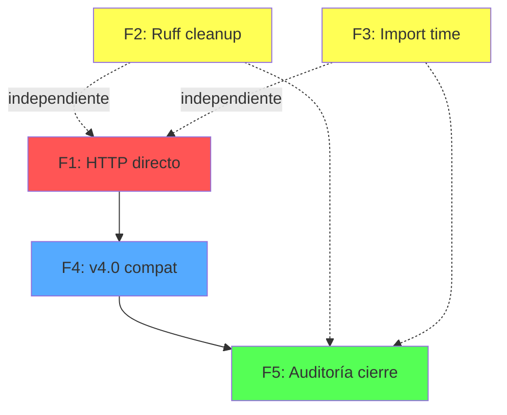

# Plan Maestro de Refactorización y Evolución — URA

**Versión:** 1.1
**Fecha:** 2026-07-21
**Baseline:** `v3.9.0-fase9` (commit `6b1cf90`)
**Total código:** 135.180 líneas, 802 archivos .py, 145 tests

## Estado Actual

### Cerrado (no reabrir)
| Fase | Logro | Tag |
|------|-------|-----|
| Scanner/Diagnostico State | Extraídos de `__init__.py` → módulos + `_state.py` | `v3.5.3` |
| core/interfaces/ | 5 protocolos (IConfigProvider, IExecutor, IVectorStore, ILLMClient, ISecretStore) | `v3.6.0` |
| Facade scripts | motor/cli/public_api (19 símbolos, política documentada) | `v3.6.0` |
| Deprecation policy | DeprecationWarning en __getattr__, reglas en AGENTS.md | `v3.6.1` |
| Logging consolidation | setup_logging() canónico, 0 module-level basicConfig | `v3.7.0` |
| Dead code removal | 731 líneas (providers legacy, build/, param muerto) | `v3.7.2` |
| CircuitBreaker bugfix | Diagnóstico corregido, decisión no consolidar documentada | `v3.7.1` |
| test_debt_cleanup | Registry lazy init regression fixed (10/10) | `v3.7.4` |
| Wrapper cleanup | DeprecationWarning en wrappers, type:ignore unused | `v3.7.6` |
| P1 core→interfaces | 14 archivos migrados a inyección de dependencias | `v3.9.0` |
| CircuitBreaker unificación | ❌ Decisión: no consolidar (dos diseños, responsabilidades distintas) | `v3.7.1` |
| Benchmarks→facade | ❌ Decisión: no migrar (APIs específicas, fuera de flujo producto) | `v3.7.5` |

### Deuda Técnica Pendiente (verificada)

| ID | Ítem | Tipo | Prioridad | Esfuerzo | Depende de |
|----|------|------|-----------|----------|------------|
| **D01** | HTTP directo en `core/mochila/routes/proxy.py` (3 ocurrencias httpx a Ollama) | Arquitectura | 🔴 Alta | 2h | — |
| **D02** | HTTP directo en `core/mochila/vram_scheduler.py` (httpx a Ollama) | Arquitectura | 🔴 Alta | 0.5h | — |
| **D03** | Ruff: 80 errores (62 EXE001 cosmético + 18 reales) | Calidad | 🟡 Media | 1h | — |
| **D04** | Import time `core.mochila._state` 182ms | Rendimiento | 🟡 Media | 1h | — |
| **D05** | Capas compatibilidad: retirar en v4.0 (`__getattr__`, `model_router_main.py`) | Arquitectura | 🔮 v4.0 | 0.5h | — |

### No es Deuda (decisiones conscientes)
| Ítem | Razón |
|------|-------|
| CircuitBreaker mochila independiente | Provider-aware + persistencia JSON vs canónico in-memory |
| 6 benchmarks con imports directos | APIs específicas fuera del flujo del producto |
| `motor/cli/cmd_ura.py:250` urllib a métricas | Endpoint no abstracto por motor.core.llm |
| `core/mochila/_state.py` imports lazy de providers | Construcción de estado, no lógica de dominio |
| 8 tests fallidos pre-existentes | Proveedores externos (Gemini, LMStudio, OpenRouter, VLLM) |

---

## Fase 1: Eliminar HTTP Directo a Ollama (D01 + D02)

### Objetivo
Reemplazar llamadas HTTP directas a Ollama en `core/mochila/` por el canónico `motor.core.llm` **únicamente donde la API canónica cubra la funcionalidad**. Si una capacidad no está soportada por `motor.core.llm`, mantener el acceso directo y documentar la excepción.

### Justificación Técnica
`core/mochila/routes/proxy.py` y `core/mochila/vram_scheduler.py` usan `httpx.AsyncClient` directamente contra Ollama. Esto:
- Duplica la lógica de conexión (timeouts, retries, URL resolution)
- Impide la gestión unificada de circuit breakers y rate limiting
- Crea un punto de acoplamiento directo a un detalle de infraestructura

**Regla:** Eliminar únicamente el HTTP directo que ya esté cubierto por `motor.core.llm`. No degradar funcionalidades para cumplir un objetivo arquitectónico.

### Requisitos Previos
- ✅ P1 core→interfaces completado (v3.9.0)
- ✅ `motor.core.llm` con `generate()`/`health()`/`embed()` funcionales

### Inventario Inicial
- `core/mochila/routes/proxy.py:38,53,95` — `httpx.AsyncClient(base_url=OLLAMA_SOCKET)` para proxy de chat (incluye streaming SSE)
- `core/mochila/vram_scheduler.py:28` — `httpx.AsyncClient(base_url=OLLAMA_SOCKET)` para consultar `/api/tags`
- `OLLAMA_SOCKET` definido en `core/mochila/constants.py`

### Plan de Migración
1. **proxy.py (no-streaming):** Reemplazar `client.post("/api/chat", ...)` por `motor.core.llm.generate()` para requests sin streaming.
2. **proxy.py (streaming SSE):** Verificar si `motor.core.llm` soporta streaming. Si no, **mantener HTTP directo** y documentar la excepción con un comentario que indique qué capacidad falta en la API canónica.
3. **vram_scheduler.py:** Analizar si `motor.core.llm.health()` expone los modelos disponibles (campo `modelos_disponibles`). Si no, mantener la llamada directa a `/api/tags` y documentar la carencia.
4. Si después de la migración `OLLAMA_SOCKET` queda sin consumidores, eliminar la constante.

### Riesgos
- Streaming SSE puede no estar soportado por `motor.core.llm.generate()` (es síncrono). Si el proxy depende de streaming para su funcionalidad principal, mantener HTTP directo es la decisión correcta.
- `vram_scheduler.py` consulta modelos disponibles. Si `health()` no expresa esa información, la migración degradaría la funcionalidad.

### Validaciones Obligatorias
- `pytest motor/tests/ -q --no-cov` — 0 regresiones
- `ruff check core/mochila/` — 0 errores nuevos
- `mypy core/mochila/ --no-strict-optional --ignore-missing-imports` — sin regresiones
- `bandit -r core/mochila/` — sin issues nuevos

### Criterios de Cierre
- Todo HTTP directo a Ollama que tenga cobertura en `motor.core.llm` está migrado
- Todo HTTP directo mantenido tiene un comentario `# EXCEPCIÓN: <capacidad faltante>` con la razón
- `vram_scheduler.py` documentado si no se migra

### Documentación Requerida
- Actualizar `ACOPLAMIENTO_AUDIT.md` con el progreso
- Cada excepción documentada in-situ con comentario explicativo

---

## Fase 2: Ruff Cleanup (D03)

### Objetivo
Reducir los errores de ruff de 80 a 0 (o documentados como excepciones intencionales), **sin mezclar con cambios arquitectónicos ni introducir cambios de comportamiento**.

### Justificación Técnica
80 errores dificultan detectar nuevos problemas en CI. Sin embargo, no todos los errores tienen el mismo tratamiento:
- Los mecánicos (EXE001, G010) se corrigen sin revisión
- Los estructurales (S110, TC001, ASYNC240) requieren evaluación caso por caso

### Requisitos Previos
- Ninguno (independiente de otras fases)

### Inventario Inicial
| Error | Count | Naturaleza | Acción |
|-------|-------|-----------|--------|
| EXE001 | 62 | Archivo tiene shebang pero no es ejecutable | Mecánica: `chmod +x` |
| G010 | 6 | `logging.warn()` → `logging.warning()` | Mecánica: find & replace |
| S110 | varios | `try/except/pass` sin logging | **Revisión caso por caso** (algunos son degradación intencional) |
| TC001 | 1 | Import en TYPE_CHECKING | Mecánica: mover import |
| ASYNC240 | 1 | pathlib en async | Revisión (puede requerir `anyio.Path`) |
| INP001 | 2 | Namespace package | Mecánica: añadir `__init__.py` |
| Otros | ~8 | PLC0414, PLW0603, PERF401 | Mecánica: `ruff --fix` |

### Plan de Migración
1. Corregir errores mecánicos (EXE001, G010, INP001, TC001, PLC0414, PLW0603, PERF401) — comandos batch + `ruff --fix`
2. Revisar S110 cada caso: si es degradación controlada, mantener con `# noqa` y comentario. Si es un error real, corregir.
3. Revisar ASYNC240: evaluar si se puede reemplazar `Path` por `anyio.Path` o si es falso positivo.
4. **No convertir "0 errores Ruff" en objetivo absoluto** si corregir un error implica cambiar comportamiento. Documentar excepciones.

### Riesgos
- Mínimo. EXE001 es cosmético. G010 y otros son correcciones directas.
- S110 requiere criterio: no silenciar excepciones que deberían ser registradas.

### Validaciones Obligatorias
- `ruff check . --output-format=concise` — 0 errores (o documentados)
- `pytest -q --no-cov` — 0 regresiones

### Criterios de Cierre
- 0 errores ruff, o cada error restante tiene `# noqa` con comentario de justificación

### Documentación Requerida
- Cada `# noqa` mantenido debe tener comentario explicando por qué es necesario

---

## Fase 3: Optimización Import Time de `core.mochila._state` (D04)

### Objetivo
Identificar el cuello de botella en el tiempo de importación de `core.mochila._state` (actualmente 182ms) y aplicar la optimización que tenga la relación beneficio/riesgo más favorable. **El objetivo no es un número concreto, sino una mejora demostrable.**

### Justificación Técnica
Con 182ms, este módulo es el más lento en el hot path de import (52% del total acumulado). Afecta el tiempo de arranque de servicios que usan Mochila.

### Requisitos Previos
- Ninguno (puede ejecutarse en paralelo con Fase 1 y 2)

### Inventario Inicial
- `core/mochila/_state.py` — imports dentro de `build_mochila_state()`:
  ```python
  from motor.core.llm.gemini import GeminiProvider as MotorGemini
  from motor.core.llm.ollama import OllamaProvider as MotorOllama
  from motor.core.llm.openrouter import OpenRouterProvider as MotorOpenRouter
  ```

### Plan de Migración
1. **Medir** tiempo exacto de cada import por separado para identificar el cuello de botella.
2. **Diagnosticar** si el problema es un provider específico (gemini suele arrastrar httpx/google.ai) o es la suma de todos.
3. **Aplicar** la optimización según el diagnóstico:
   - Si un provider es el culpable: convertir su import a perezoso adicional (ya lo es dentro de función, pero el primer acceso paga el costo)
   - Si es la suma de varios: evaluar si se pueden agrupar o si hay dependencias redundantes
4. **Medir de nuevo** y documentar la mejora real (pueden ser 40ms, 60ms o 20ms — el valor concreto depende del diagnóstico).

### Riesgos
- Bajo. Los imports ya son lazy (dentro de función). No hay cambio de comportamiento, solo optimización del tiempo de primer acceso.

### Validaciones Obligatorias
- Medición de import time antes/después documentada
- `ruff check core/mochila/_state.py` — 0 errores
- `pytest motor/tests/ -q --no-cov` — 0 regresiones

### Criterios de Cierre
- Cuello de botella identificado y documentado
- Mejora de rendimiento demostrada (cualquier reducción significativa)
- Si no se encuentra un cuello de botella claro, documentar y cerrar sin cambios

### Documentación Requerida
- Actualizar `METRICAS_BASELINE.md` con el nuevo valor y el diagnóstico

---

## Fase 4: Retirada de Capas de Compatibilidad — v4.0 (D05)

### Objetivo
Eliminar las capas de compatibilidad que emitían DeprecationWarning desde v3.6, **solo después de verificar que no existen consumidores internos**.

### Justificación Técnica
Las capas de compatibilidad (`__getattr__` en `motor/core/llm/__init__.py` y `core/model_router/router.py`, más `core/model_router_main.py`) se marcaron como deprecadas en v3.6. Mantenerlas más allá de v4.0 convierte deuda temporal en deuda permanente.

### Requisitos Previos
- ✅ DeprecationWarning activo desde v3.6.1
- ✅ Política de deprecación documentada en AGENTS.md (v3.x marcar, v4.0 eliminar)
- Fase 1 completa (por si la migración de HTTP introduce nuevos consumidores de rutas deprecadas)

### Inventario Inicial
| Capa | Archivo | Deprecado en | Consumidores (verificado) |
|------|---------|-------------|--------------------------|
| `__getattr__` → `registry`/`_default` | `motor/core/llm/__init__.py` | v3.6 | 0 (nadie importa registry de `__init__`) |
| `__getattr__` → `OLLAMA_URL`/`_URLS` | `core/model_router/router.py` | v3.6 | 0 (todos usan `get_urls()`/`get_ollama_url()`) |
| `model_router_main.py` shim | `core/model_router_main.py` | v3.6 | Verificar con grep |

### Condiciones para Proceder
**No retirar ninguna capa hasta verificar que:**
1. No existen consumidores internos de los símbolos deprecados
2. La política de deprecación prevista para v4.0 se ha cumplido (v3.x marcar, v4.0 eliminar)
3. No hay scripts externos o servicios que dependan de estas rutas

### Plan de Migración
1. Verificar con grep que ningún archivo importa los símbolos deprecados
2. Si hay consumidores, notificarlos y planificar su migración antes de eliminar
3. Si no hay consumidores:
   - Eliminar `__getattr__` de `motor/core/llm/__init__.py`
   - Eliminar `__getattr__` de `core/model_router/router.py`
   - Eliminar `core/model_router_main.py`
4. Verificar que todo compila y tests pasan

### Riesgos
- Bajo. Las rutas deprecadas no tienen consumidores (verificado en v3.7). Si algún consumidor externo las usa, el error será inmediato (AttributeError) y fácil de diagnosticar. La verificación previa elimina este riesgo.

### Validaciones Obligatorias
- `grep -rn "from motor\.core\.llm import.*registry\|from motor\.core\.llm import.*_default"` — 0 resultados
- `grep -rn "OLLAMA_URL\|_URLS"` — solo referencias a `get_urls()`/`get_ollama_url()`
- `pytest -q --no-cov` — 0 regresiones
- `ruff check .` — 0 errores nuevos

### Criterios de Cierre
- 0 `__getattr__` en `motor/core/llm/__init__.py` y `core/model_router/router.py`
- `core/model_router_main.py` eliminado
- Ningún test roto por la eliminación

### Documentación Requerida
- AGENTS.md: eliminar referencias a los shims
- `docs/architecture/v4.0_COMPAT_REMOVAL.md`: registro de lo eliminado

---

## Fase 5: Auditoría de Cierre

### Objetivo
Verificar que el plan Maestro ha conseguido su objetivo: deuda técnica conocida = 0 (salvo decisiones documentadas), arquitectura coherente, herramientas de calidad estables.

No es una fase de limpieza adicional — es una **validación** de que el plan se completó correctamente.

### Requisitos Previos
- Fases 1, 2, 3, 4 completadas

### Checklist de Validación

| # | Check | Métrica |
|---|-------|---------|
| 1 | Arquitectura coherente | core no importa de motor (salvo excepciones documentadas) |
| 2 | Deuda técnica conocida | 0 items sin documentar (cada excepción tiene ADR o comentario) |
| 3 | Tests completos | `pytest -q --no-cov` — mismo resultado que baseline (sin regresiones) |
| 4 | Ruff | `ruff check .` — 0 errores (o documentados) |
| 5 | Mypy | `mypy motor/ core/` — sin regresiones respecto a baseline (`v3.9.0`) |
| 6 | Bandit | `bandit -r motor/ core/` — sin issues nuevos |
| 7 | Documentación sincronizada | AGENTS.md, ACOPPLAMIENTO_AUDIT.md, METRICAS_BASELINE.md reflejan estado real |
| 8 | Inventario actualizado | `METRICAS_BASELINE.md` actualizado con valores post-fases |
| 9 | Working tree | `git status` sin cambios sin commitear |
| 10 | Tag | `git tag -a v4.0.0` |

### Plan de Ejecución
1. Ejecutar cada herramienta de calidad y registrar resultados
2. Comparar contra baseline (`v3.9.0`)
3. Si hay regresiones, documentarlas como hallazgos (no corregir)
4. Generar acta de cierre

### Riesgos
- Ninguno. Es una fase de medición, no de modificación.

### Validaciones Obligatorias
- Las mismas 10 del checklist

### Criterios de Cierre
- Los 10 checks pasan, o cada fallo tiene una explicación documentada
- Acta de cierre generada

### Documentación Requerida
- `docs/architecture/MASTER_PLAN_CLOSEOUT.md` con resultados de los 10 checks

---

## Mapa de Dependencias



**Ejecución en paralelo:** F1, F2 y F3 pueden ejecutarse simultáneamente.
**Secuencia obligatoria:** F1 → F4 → F5. F2 y F3 convergen en F5.

---

## Línea de Tiempo Estimada

| Fase | Esfuerzo | Paralelo | Prioridad |
|------|----------|----------|-----------|
| F1: HTTP directo | 2.5h | ✅ Sí (con F2, F3) | 🔴 Alta |
| F2: Ruff cleanup | 1h | ✅ Sí (con F1, F3) | 🟡 Media |
| F3: Import time | 1h | ✅ Sí (con F1, F2) | 🟡 Media |
| F4: v4.0 compat | 0.5h | ❌ No (después de F1) | 🔮 v4.0 |
| F5: Auditoría cierre | 0.5h | ❌ No (después de F1-F4) | 🔮 Cierre |
| **Total** | **~5.5h** | **~3.5h secuencial** | |

---

## Lo Que NO Está en el Plan (justificado)

| Propuesta | Razón |
|-----------|-------|
| Unificar CircuitBreaker | Dos diseños distintos (provider-aware+persistencia vs genérica). Decisión documentada en v3.7.1. |
| Migrar 6 benchmarks a facade | APIs específicas fuera del flujo del producto. Política documentada en v3.7.5. |
| Refactorizar módulos grandes | Ningún módulo de producción >1000 líneas (verificado). |
| Añadir nuevas capas arquitectónicas | Sin justificación técnica demostrable. Las 5 interfaces existentes cubren las necesidades actuales. |
| TypeScript/Web frontend | Fuera del alcance (proyecto Python/server-side). |
| Migrar a nuevo framework | Sin justificación. El stack actual (FastAPI, httpx, Qdrant) es estable. |
| Wrappers redundantes | DeprecationWarning activo desde v3.7.6, target v4.0 (Fase 4). |
