# Diagrama de Arquitectura — Knowledge Engine

```mermaid
graph TB
    subgraph CLI["CLI (ke)"]
        C_COMPILE[compile]
        C_SEARCH[search]
        C_ARCHIVE[archive]
        C_DOCTOR[doctor]
        C_AUDIT[audit-db]
        C_RULES[rules]
        C_AGENT[agent]
        C_PIPELINE[pipeline]
    end

    subgraph CORE["Knowledge Engine Core"]
        ORC[Orchestrator<br/>request_compile]
        COMP[Compiler<br/>compile_source]
        READ[Reader<br/>search / get_document]
        VER[Verifier<br/>verify_graph]
        MIG[Migrations]
        DET[Determinism<br/>sha256-v2]
    end

    subgraph OPER["Operational"]
        JOBS[Jobs<br/>enqueue / process]
        ARCH[Archiver<br/>git bundle]
        QDR[Qdrant Sync]
        RULES[Rules<br/>SafeEval R001-R005]
        DEDUCT[StateDeductor]
        REC[Recommendation<br/>Validator]
    end

    subgraph AUDIT["Audit / Observability"]
        AUD[AuditService]
        NDJSON[NDJSON Backend]
        SQLAUD[SQLite Backend]
        MET[Metrics<br/>Prometheus]
        LOG[Logging<br/>correlation_id]
    end

    subgraph PIPELINE["Pipeline DAG"]
        P_SNAP[snapshot]
        P_COMP[compile]
        P_VER[verify]
        P_ARCH[archive]
        P_QDR[qdrant]
        P_RULES[rule_eval]
        P_CI[ci ✅]
    end

    subgraph INFRA["Infrastructure"]
        CONN[Connection<br/>open_db / begin_immediate]
        LOCK[Lock<br/>flock compile]
        SQL[(SQLite<br/>WAL)]
        GIT[(Git)]
    end

    %% CLI → Core
    C_COMPILE --> ORC
    C_SEARCH --> READ
    C_ARCHIVE --> ARCH
    C_DOCTOR --> VER
    C_AUDIT --> CONN
    C_RULES --> RULES
    C_AGENT --> READ
    C_PIPELINE --> PIPELINE

    %% Pipeline stages
    P_SNAP --> P_COMP --> P_VER --> P_ARCH --> P_QDR --> P_RULES --> P_CI
    PIPELINE --> COMP
    PIPELINE --> VER
    PIPELINE --> ARCH
    PIPELINE --> RULES

    %% Core → Operational
    ORC --> COMP
    ORC --> JOBS
    COMP --> AUD
    READ --> AUD

    %% Operational → Infrastructure
    JOBS --> CONN
    COMP --> CONN
    READ --> CONN
    ARCH --> GIT
    QDR --> SQL

    %% Audit → Infrastructure
    AUD --> NDJSON
    AUD --> SQLAUD
    SQLAUD --> CONN
    MET --> CONN
    LOG --> AUD

    %% Infrastructure
    CONN --> SQL
    LOCK --> CONN
    MIG --> CONN

    %% Styling
    classDef cli fill:#e1f5fe,stroke:#01579b
    classDef core fill:#f3e5f5,stroke:#7b1fa2
    classDef oper fill:#e8f5e9,stroke:#2e7d32
    classDef audit fill:#fff3e0,stroke:#e65100
    classDef pipe fill:#fce4ec,stroke:#c62828
    classDef infra fill:#f5f5f5,stroke:#616161
    class C_COMPILE,C_SEARCH,C_ARCHIVE,C_DOCTOR,C_AUDIT,C_RULES,C_AGENT,C_PIPELINE cli
    class ORC,COMP,READ,VER,MIG,DET core
    class JOBS,ARCH,QDR,RULES,DEDUCT,REC oper
    class AUD,NDJSON,SQLAUD,MET,LOG audit
    class P_SNAP,P_COMP,P_VER,P_ARCH,P_QDR,P_RULES,P_CI pipe
    class CONN,LOCK,SQL,GIT infra
```

## Flujo de datos

| Dirección | Prohibido | Permitido |
|---|---|---|
| Core → Infra | ✅ | connection.py → SQLite |
| Operational → Core | ❌ | jobs.py → orchestrator.py |
| Audit → Core | ❌ | audit → kg_* |
| CLI → Core | ✅ | CLI → Orchestrator |

## Invariantes visuales

1. **Las flechas solo van hacia abajo.** Ninguna capa superior importa de una inferior.
2. **Reader nunca escribe.** Sus flechas solo apuntan a SQL (lectura) y Audit (log).
3. **Pipeline es un meta-evaluador.** Puede ejecutar CI como stage.
4. **Connection es la única que abre SQLite.**
